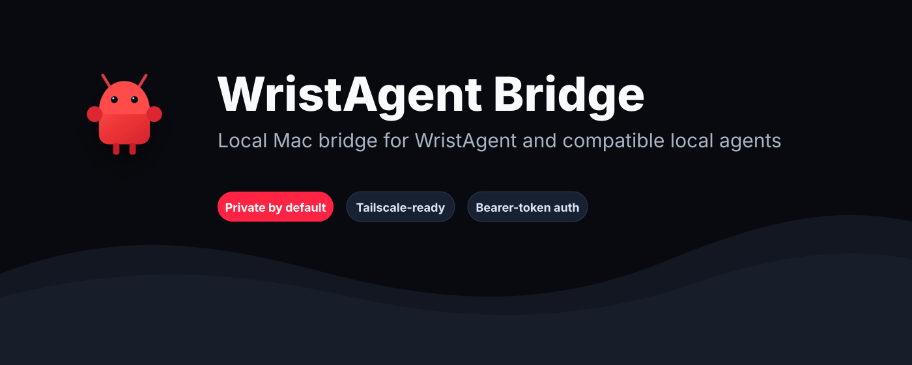
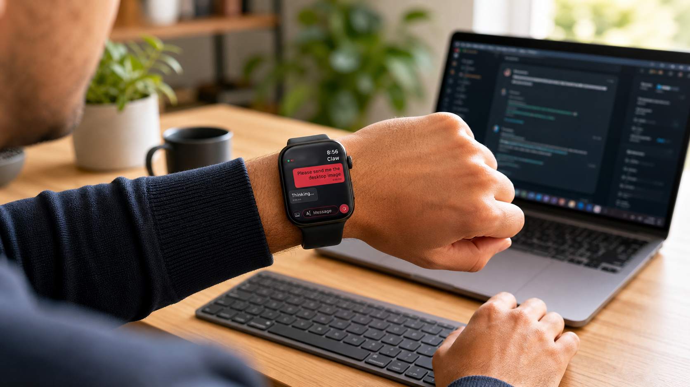
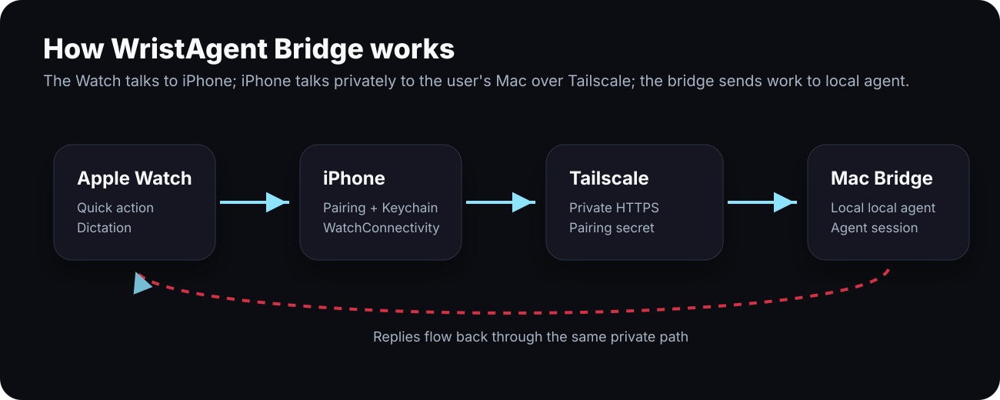

# WristAgent Bridge

<p align="center">
  
</p>

Local Mac bridge for WristAgent, the iPhone and Apple Watch companion for compatible local agents.

WristAgent Bridge keeps the user's setup private by default. It binds to `127.0.0.1`, requires a pairing secret, and is designed to be exposed only through Tailscale Serve inside the user's own tailnet.

This repo is one half of the WristAgent product:

- `samboydevelopment/WristAgent`: iPhone, Apple Watch, and widget app.
- `samboydevelopment/wristclaw-bridge`: local Mac bridge that connects WristAgent to the user's own local agent setup.

<p align="center">
  
</p>

<p align="center">
  <strong>Control and work with your computer directly from your wrist.</strong>
</p>

## What It Does

WristAgent Bridge lets the Watch app send short commands to an compatible local agent running on the user's Mac.

- Sends typed, dictated, and quick-action prompts from Apple Watch.
- Returns compact agent replies sized for the Watch.
- Supports session selection and session creation from the Watch.
- Can forward agent screenshots or image attachments back to the Watch.
- Can serve natural voice audio when the local agent is configured with ElevenLabs.
- Generates private pairing files for the iPhone app: QR code, deep link, and manual payload.

## How It Works

<p align="center">
  
</p>

1. Apple Watch captures a command.
2. WristAgent sends it to the paired iPhone using WatchConnectivity.
3. iPhone sends an authenticated HTTPS request through the user's Tailscale network.
4. WristAgent Bridge receives the request on the Mac and calls the local local agent CLI/session.
5. The response flows back to iPhone and then to Apple Watch.

## Quick Start

### 1. Clone and install

```bash
git clone https://github.com/samboydevelopment/wristclaw-bridge.git
cd wristclaw-bridge
npm install
```

### 2. Run setup

```bash
npm run setup
```

The guided setup checks Node.js, the local agent, Tailscale, local bridge port availability, and the configured local agent session.

It creates private config at:

```text
~/.openclaw/openclaw-watch/config.env
```

The `openclaw-watch` directory name is retained for compatibility with existing local installs.

### 3. Start the bridge

```bash
npm start
```

In another terminal, verify the local bridge:

```bash
npm run health
npm run diagnose
```

If the connection breaks after an the local agent, Tailscale, or bridge update, run:

```bash
npm run repair
```

### 4. Expose privately with Tailscale Serve

```bash
tailscale serve --bg --set-path /watch http://127.0.0.1:8787
```

Use the resulting HTTPS URL ending in:

```text
/watch/ask
```

### 5. Generate pairing files

If Tailscale Serve was enabled or changed after setup, regenerate pairing files:

```bash
npm run pair
```

This creates:

```text
~/.openclaw/openclaw-watch/pairing.json
~/.openclaw/openclaw-watch/pairing.url
~/.openclaw/openclaw-watch/pairing-qr.svg
~/.openclaw/openclaw-watch/pairing.html
```

Open the pairing page on the Mac:

```bash
open ~/.openclaw/openclaw-watch/pairing.html
```

The QR/deep link uses `wristagent://pair` and includes the ask URL, health URL, diagnostics URL, agent name, and pairing secret.

Do not publish or share the pairing files. They contain a pairing secret.

## Requirements

- macOS with Node.js installed.
- a compatible local agent installed and authenticated on the Mac.
- Tailscale installed, connected, and signed in.
- iPhone and Mac connected to the same user-owned Tailscale tailnet.
- WristAgent installed on iPhone and Apple Watch.

## User Onboarding

Use this flow for a fresh user installing WristAgent.

1. Install and authenticate local agent on the Mac.
2. Clone this bridge repo and run `npm install`.
3. Run `npm run setup`.
4. Start the bridge with `npm start`.
5. Run `npm run health` and `npm run diagnose`.
6. Enable Tailscale Serve for `/watch`.
7. Run `npm run pair`.
8. Open `~/.openclaw/openclaw-watch/pairing.html`.
9. Open WristAgent on iPhone and scan the QR.
10. Confirm diagnostics pass and sync the configuration to Apple Watch.
11. Send a test message from Apple Watch.

QC is complete when the Watch can send a message, receive a response, load messages for the selected session, and create/select sessions.

## Repair After Updates

the local agent, Tailscale, updates can occasionally disturb the local bridge path or the Tailscale Serve route. Use the repair command before re-pairing devices:

```bash
npm run repair
```

The repair command:

- Loads the existing `~/.openclaw/openclaw-watch/config.env`.
- Verifies local `/health` and authenticated `/watch/diagnostics`.
- Checks that `openclaw` and `tailscale` are available.
- Reapplies `tailscale serve --bg --set-path /watch http://127.0.0.1:8787` using your configured host/port.
- Regenerates pairing files when a public Tailscale ask URL is configured.
- Prints whether re-pairing is needed.

It does not rotate your token or replace your configured local agent session. If diagnostics reports a missing session after an local agent update, run `npm run setup` to refresh the session configuration.

## Uninstall

To remove the local bridge service and reset pairing on this Mac:

```bash
npm run uninstall
```

This command:

- Stops the LaunchAgent when it was installed with `npm run setup:launch-agent`.
- Stops the local bridge process when it is listening on the configured port.
- Removes `~/Library/LaunchAgents/com.openclaw.watch-bridge.plist`.
- Moves `~/.openclaw/openclaw-watch` to a timestamped backup.

It does not delete local agent sessions under `~/.openclaw/agents`, remove this Git repository, or change Tailscale Serve routes. The backup contains pairing files and pairing secrets, so keep it private or delete it when no longer needed.

To delete local bridge config instead of backing it up:

```bash
npm run uninstall -- --purge
```

To stop/remove the service while keeping local pairing config in place:

```bash
npm run uninstall -- --keep-config
```

If `/watch` was used only for WristAgent, remove or replace that route from Tailscale after uninstalling.

## Configuration

The setup wizard writes `config.env` with values such as:

```text
OPENCLAW_WATCH_BRIDGE_HOST
OPENCLAW_WATCH_BRIDGE_PORT
OPENCLAW_WATCH_BRIDGE_TOKEN
OPENCLAW_WATCH_AGENT_NAME
OPENCLAW_WATCH_AGENT_SESSION_ID
OPENCLAW_WATCH_SESSIONS_PATH
OPENCLAW_WATCH_PUBLIC_ASK_URL
```

Optional display names shown in the Watch chat UI:

```text
OPENCLAW_WATCH_USER_DISPLAY_ROLE="you"
OPENCLAW_WATCH_ASSISTANT_DISPLAY_ROLE="assistant"
```

The defaults are placeholders. Users should set their own display names before pairing if they want customized chat labels.

## Endpoints

- `GET /health`: local bridge liveness.
- `GET /watch/diagnostics`: authenticated user-facing diagnostics.
- `POST /watch/ask`: authenticated agent request endpoint.
- `GET /watch/sessions`: list agent sessions.
- `GET /watch/messages`: read messages for a selected session.
- `POST /watch/sessions`: create a named session from the Watch.

By default, `/watch/ask` returns agent/runtime failures as HTTP 200 JSON with `status: "error"` so Apple Shortcuts and iOS clients can display the bridge error instead of surfacing a generic transport error. Set this to preserve HTTP 500 responses:

```text
OPENCLAW_WATCH_SHORTCUT_FRIENDLY_ERRORS=false
```

## Agent Images

The agent can attach an outgoing image to its reply by including one of these markers anywhere in its response text:

```text
[screenshot]
[image: /path/to/file]
```

The bridge strips the marker before returning the text reply, compresses the image to a Watch-friendly JPEG using `sips`, and forwards it to the Watch.

`[screenshot]` uses macOS `screencapture`, which requires Screen Recording permission for the process running the bridge.

## Optional Voice Replies

By default, WristAgent reads replies using the on-device Apple voice. If the local agent is configured with ElevenLabs under `talk.provider` in `~/.openclaw/openclaw.json`, the Watch can use that voice instead.

Check readiness with:

```bash
npm run diagnose
```

If diagnostics reports `Natural voice: elevenlabs ready`, enable **ElevenLabs voice** in Watch settings.

## Security Model

- The bridge binds to `127.0.0.1` by default.
- Requests require `Authorization: Bearer <token>` when a token is configured.
- Generated config is written to `~/.openclaw/openclaw-watch/config.env` with private file permissions.
- Tailscale Serve is the recommended exposure path.
- Tailscale Funnel or public internet exposure is not part of the default flow.
- `scripts/watch-bridge.mjs` runs local local agent CLI commands by design.

See `references/security.md` for the release checklist and security notes.

## Plugin Structure

```text
.codex-plugin/plugin.json       Plugin manifest
skills/openclaw-watch/SKILL.md  Agent instructions
scripts/setup.mjs               Config/token/LaunchAgent setup
scripts/start-bridge.mjs        Starts the local bridge
scripts/healthcheck.mjs         Checks the local bridge
scripts/diagnose.mjs            Prints user-facing bridge diagnostics
scripts/watch-bridge.mjs        HTTP bridge implementation
scripts/uninstall.mjs           Stops and removes the local bridge service/config
references/                     Setup and security notes
docs/                           GitHub Pages privacy/support pages
assets/                         Public README visuals
```

## Disclaimer

WristAgent is an independent third-party companion app. It is not affiliated with, authorized, or endorsed by the creators of the third-party agent project or Apple Inc.
